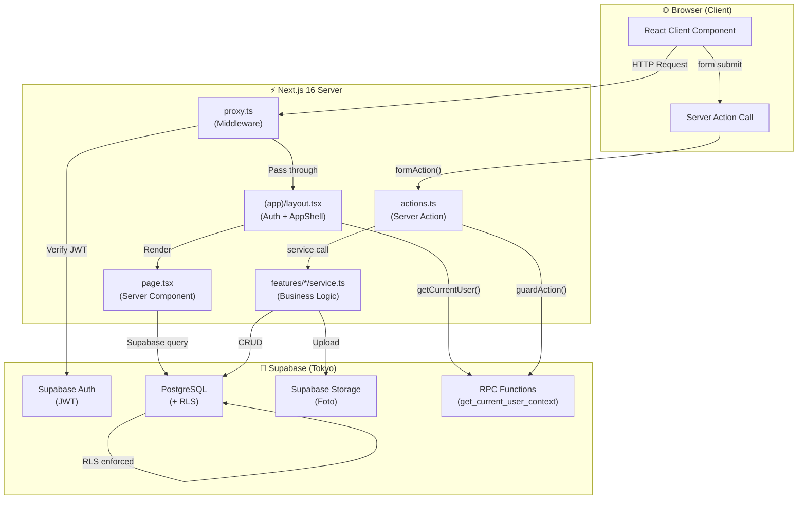
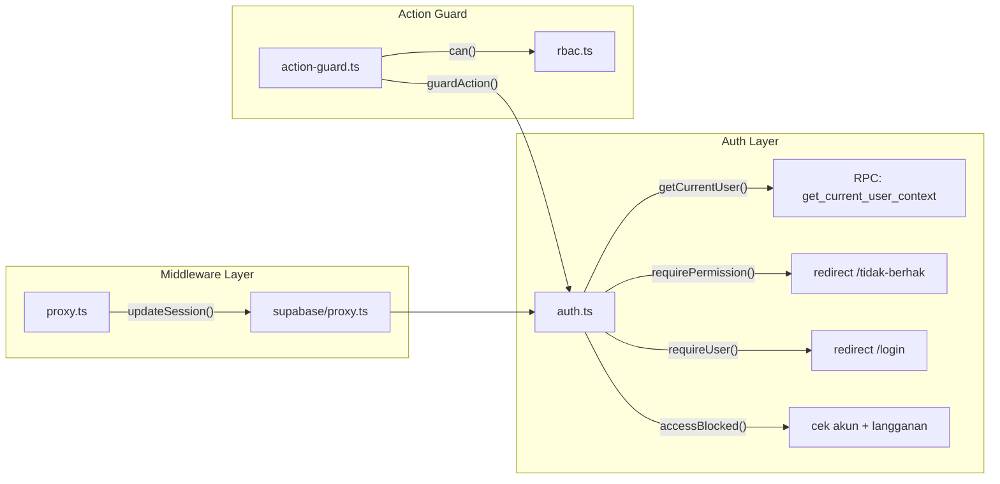
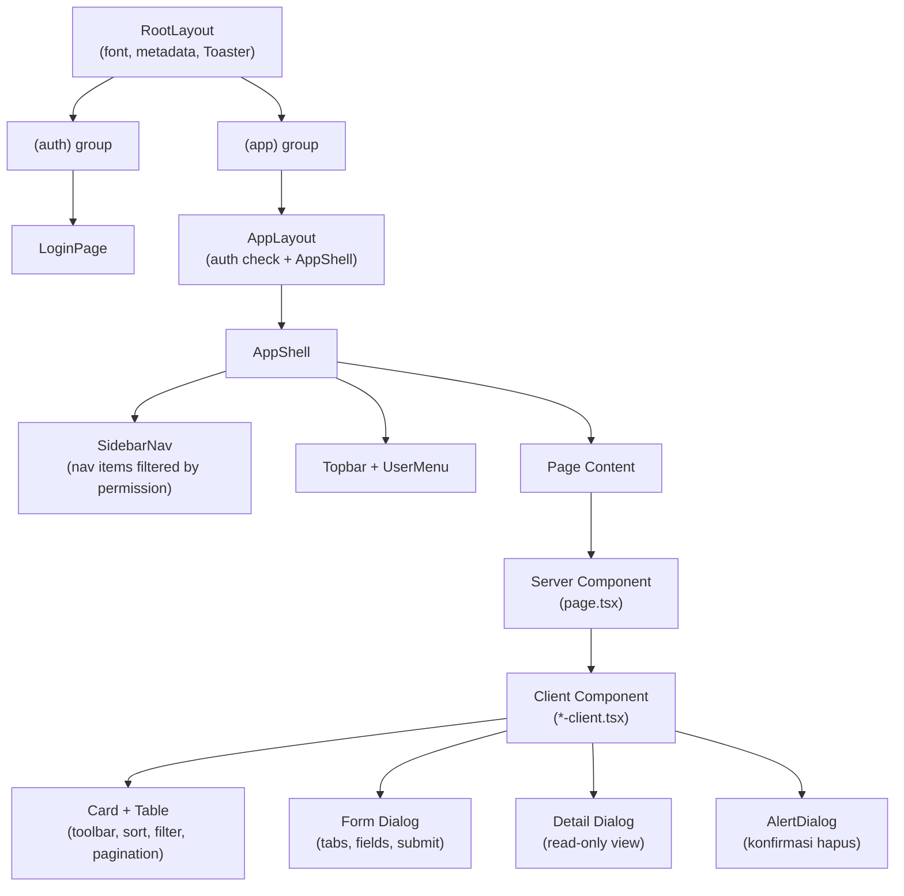
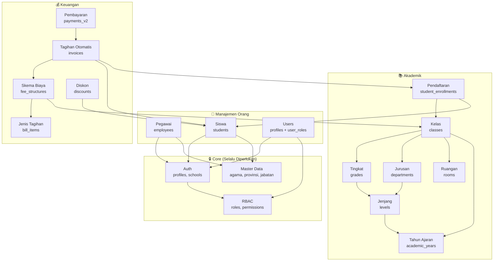
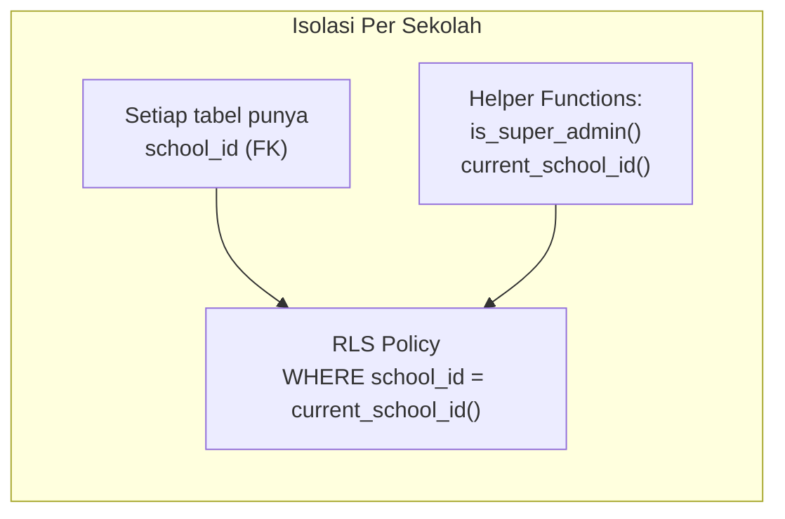

# Arsitektur Aplikasi — ERP Sekolah

> Dokumen ini menjelaskan struktur folder, alur data, komponen utama, dan
> hubungan antar modul. Baca sebelum membuat perubahan arsitektural atau
> menambah modul baru.

---

## 1. Struktur Folder Lengkap

```
erp-sekolah/
│
├── knowledge/                    # Dokumen referensi knowledge
│   ├── prd.md                    # Product Requirements Document
│   ├── design.md                 # Standar desain & template komponen
│   └── ARCHITECTURE.md           # ← Dokumen ini
│
├── public/                       # Aset statis (favicon, template xlsx)
│   └── templates/                # Template import Excel
│
├── supabase/
│   ├── migrations/               # 36 migration files (0001–0036)
│   │   ├── 0001_init_rbac.sql          # Tabel auth: profiles, roles, permissions
│   │   ├── 0002_seed_rbac.sql          # Seed data permission
│   │   ├── 0003_current_user_context.sql # RPC get_current_user_context
│   │   ├── 0004_school_subscription.sql  # Langganan sekolah
│   │   ├── 0005_security_hardening.sql   # RLS + trigger keamanan
│   │   ├── 0007_master_global.sql        # Master global (agama, dll)
│   │   ├── 0008_master_tenant.sql        # Master per-tenant
│   │   ├── 0009_pegawai.sql              # Tabel employees
│   │   ├── 0010_siswa.sql                # Tabel students
│   │   ├── 0011_keuangan.sql             # Tabel keuangan dasar
│   │   ├── 0018_akademik.sql             # Tabel akademik (kelas, enrollment)
│   │   ├── 0019_fee_structures.sql       # Skema biaya
│   │   ├── 0021_invoices.sql             # Tagihan (invoices)
│   │   ├── 0022_discounts.sql            # Diskon & beasiswa
│   │   ├── 0023_payments_v2.sql          # Pembayaran v2
│   │   └── ...                           # Migration lainnya
│   └── bootstrap.sql             # Setup awal: sekolah pertama + super admin
│
├── src/
│   ├── proxy.ts                  # Entry point Next.js Middleware (auth proxy)
│   │
│   ├── app/
│   │   ├── globals.css           # Tailwind v4 + CSS custom (employee-page)
│   │   ├── layout.tsx            # Root layout (font, metadata, Toaster)
│   │   │
│   │   ├── (auth)/               # Route group: halaman publik
│   │   │   └── login/
│   │   │       └── page.tsx      # Form login (email + password)
│   │   │
│   │   └── (app)/                # Route group: area terproteksi
│   │       ├── layout.tsx        # Auth check + AppShell wrapper
│   │       ├── error.tsx         # Error boundary
│   │       ├── loading.tsx       # Loading skeleton
│   │       ├── tidak-berhak/     # Halaman 403 (permission denied)
│   │       │
│   │       ├── dashboard/        # Dashboard utama
│   │       ├── users/            # CRUD user (assign role)
│   │       ├── roles/            # CRUD role + permission matrix
│   │       ├── sekolah/          # Manajemen sekolah (super admin only)
│   │       ├── profil-sekolah/   # Profil sekolah per-tenant
│   │       ├── pegawai/          # Data pegawai (CRUD + import/export)
│   │       ├── siswa/            # Data siswa (CRUD + import/export)
│   │       ├── master/           # Master data referensi
│   │       │
│   │       ├── akademik/         # Modul akademik
│   │       │   ├── actions.ts    # Shared server actions
│   │       │   ├── tahun-ajaran/ # CRUD tahun ajaran
│   │       │   ├── jenjang/      # CRUD jenjang pendidikan
│   │       │   ├── tingkat/      # CRUD tingkat/grade
│   │       │   ├── jurusan/      # CRUD jurusan/program
│   │       │   ├── ruangan/      # CRUD ruangan
│   │       │   ├── kelas/        # CRUD kelas
│   │       │   └── pendaftaran/  # Penempatan siswa ke kelas
│   │       │
│   │       └── keuangan/         # Modul keuangan
│   │           ├── page.tsx          # Halaman utama SPP
│   │           ├── actions.ts        # Shared server actions
│   │           ├── keuangan-client.tsx # Client component utama
│   │           ├── jenis-tagihan/    # CRUD jenis tagihan
│   │           ├── skema-biaya/      # CRUD skema biaya
│   │           ├── tagihan-otomatis/ # Generate & kelola tagihan
│   │           ├── rekonsiliasi/     # Rekonsiliasi pembayaran
│   │           └── diskon/           # Diskon & beasiswa
│   │
│   ├── components/
│   │   ├── ui/                   # 19 shadcn/ui v4 components
│   │   │   ├── button.tsx        # Button (CVA: 6 variant, 8 size)
│   │   │   ├── card.tsx          # Card, CardHeader, CardContent, CardFooter
│   │   │   ├── dialog.tsx        # Dialog modal (Base UI primitive)
│   │   │   ├── alert-dialog.tsx  # Konfirmasi dialog (hapus, dll)
│   │   │   ├── table.tsx         # Table, TableHeader, TableRow, TableCell
│   │   │   ├── tabs.tsx          # Tabs (default + line variant)
│   │   │   ├── input.tsx         # Input text (Base UI primitive)
│   │   │   ├── select.tsx        # Select dropdown (Base UI primitive)
│   │   │   ├── multi-select.tsx  # Multi-select custom
│   │   │   ├── dropdown-menu.tsx # Dropdown menu
│   │   │   ├── checkbox.tsx      # Checkbox
│   │   │   ├── textarea.tsx      # Textarea
│   │   │   ├── badge.tsx         # Badge (6 variant)
│   │   │   ├── avatar.tsx        # Avatar
│   │   │   ├── label.tsx         # Label
│   │   │   ├── separator.tsx     # Separator
│   │   │   ├── sheet.tsx         # Side sheet (mobile nav)
│   │   │   ├── skeleton.tsx      # Loading skeleton
│   │   │   └── sonner.tsx        # Toast notification
│   │   │
│   │   ├── app-shell/            # Layout shell
│   │   │   ├── app-shell.tsx     # Sidebar + topbar + content area
│   │   │   ├── sidebar-nav.tsx   # Sidebar navigation
│   │   │   └── user-menu.tsx     # User dropdown menu
│   │   │
│   │   ├── data-error.tsx        # Komponen error saat gagal fetch
│   │   ├── pending-activation.tsx # Akun belum aktif
│   │   ├── setup-notice.tsx      # Supabase belum dikonfigurasi
│   │   └── subscription-blocked.tsx # Langganan bermasalah
│   │
│   ├── features/                 # Feature modules (business logic)
│   │   ├── akademik/             # schema + service akademik
│   │   ├── billing/              # schema + service tagihan otomatis
│   │   ├── discount/             # schema + service diskon
│   │   ├── fee-structure/        # schema + service skema biaya
│   │   ├── keuangan/             # schema + service keuangan
│   │   ├── master/               # schema + service master data
│   │   ├── payment-v2/           # schema + service pembayaran v2
│   │   ├── pegawai/              # schema + service + FieldLabel
│   │   ├── roles/                # schema + service role
│   │   ├── schools/              # schema + service sekolah
│   │   ├── siswa/                # schema + service siswa
│   │   └── users/                # schema + service user
│   │
│   └── lib/                      # Shared utilities
│       ├── auth.ts               # getCurrentUser, requirePermission
│       ├── action-guard.ts       # guardAction() untuk Server Actions
│       ├── rbac.ts               # PERMISSIONS, MODULE_LABELS, can()
│       ├── nav.ts                # MAIN_NAV, NAV_GROUPS sidebar config
│       ├── types.ts              # TypeScript types (semua entitas)
│       ├── database.types.ts     # Auto-generated Supabase types
│       ├── env.ts                # Environment variables
│       ├── errors.ts             # Error utilities
│       ├── result.ts             # Result type pattern
│       ├── school.ts             # subscriptionProblem()
│       ├── slug.ts               # Slug generator
│       ├── password.ts           # Password utilities
│       ├── utils.ts              # cn() (clsx + tailwind-merge)
│       ├── rate-limit/           # Rate limiter (Upstash / memory)
│       ├── validations/          # Shared validation schemas
│       ├── supabase/
│       │   ├── server.ts         # createClient() — server component
│       │   ├── admin.ts          # createAdminClient() — service role
│       │   ├── proxy.ts          # updateSession() — middleware
│       │   └── storage.ts        # Upload helper (foto siswa/pegawai)
│       └── __tests__/            # Unit tests
│
├── AGENTS.md                     # Agent guide (ringkasan + aturan)
├── CLAUDE.md                     # Redirect ke AGENTS.md
├── issue.md                      # Perencanaan fitur baru
├── next.config.ts                # Next.js config (CSP, origins)
├── components.json               # shadcn/ui config
├── tsconfig.json                 # TypeScript (path alias @/)
├── vitest.config.mts             # Vitest config
├── eslint.config.mjs             # ESLint 9 flat config
├── package.json                  # Dependencies
└── .env.example                  # Template env vars
```

---

## 2. Arsitektur High-Level



---

## 3. Alur Data (Request Lifecycle)

### 3.1 Alur Baca Data (Page Load)

```
Browser → GET /siswa
  │
  ├─ 1. proxy.ts (Middleware)
  │     └─ updateSession(): refresh JWT cookie via Supabase Auth
  │     └─ Redirect ke /login jika belum autentikasi
  │
  ├─ 2. (app)/layout.tsx
  │     └─ getCurrentUser() → RPC get_current_user_context
  │     └─ Cek: profil aktif? sekolah ada? langganan valid?
  │     └─ Filter MAIN_NAV berdasarkan permissions
  │     └─ Render <AppShell> (sidebar + topbar)
  │
  ├─ 3. siswa/page.tsx (Server Component)
  │     └─ requirePermission("students.view") → redirect jika gagal
  │     └─ supabase.from("students").select("*") → RLS filter by school_id
  │     └─ supabase.from("agama").select("*") → data referensi
  │     └─ Render <SiswaClient siswa={data} permissions={...} />
  │
  └─ 4. siswa/siswa-client.tsx (Client Component)
        └─ State: query, sorting, pagination, filters, form dialog
        └─ Render: tabel + toolbar + dialog form + dialog detail
```

### 3.2 Alur Tulis Data (Form Submit)

```
Browser → Submit form (Tambah/Ubah Siswa)
  │
  ├─ 1. Client Component
  │     └─ useActionState(saveSiswa, undefined)
  │     └─ <form action={formAction}> → kirim FormData
  │
  ├─ 2. siswa/actions.ts → saveSiswa()
  │     ├─ guardAction() → cek sesi + akun aktif
  │     ├─ readSaveSiswaInput(formData) → parse + validasi Zod
  │     ├─ guardAction({ permission }) → cek izin create/update
  │     ├─ Upload foto (jika ada) → Supabase Storage
  │     ├─ saveSiswaRecord(supabase, user, data) → service layer
  │     └─ revalidatePath("/siswa") → refresh halaman
  │
  ├─ 3. features/siswa/service.ts → saveSiswaRecord()
  │     └─ supabase.from("students").upsert(data)
  │     └─ RLS memastikan school_id cocok
  │
  └─ 4. Kembali ke Client
        ├─ state.success → onSaved() + tutup dialog + banner sukses
        └─ state.error → toast.error()
```

### 3.3 Alur Hapus Data

```
Browser → Klik tombol Hapus → AlertDialog konfirmasi
  │
  ├─ 1. Client: startTransition(() => deleteSiswa(id))
  ├─ 2. actions.ts: guardAction({ permission: "students.delete" })
  ├─ 3. service.ts: supabase.from("students").delete().eq("id", id)
  ├─ 4. revalidatePath("/siswa")
  └─ 5. Client: toast.success() + banner
```

---

## 4. Komponen Utama

### 4.1 Layer Autentikasi & Otorisasi



| Komponen | File | Fungsi |
|---|---|---|
| **Middleware** | `src/proxy.ts` → `lib/supabase/proxy.ts` | Refresh JWT, redirect unauthenticated |
| **getCurrentUser** | `lib/auth.ts` | Single-RPC fetch (profile + school + roles + permissions) |
| **requirePermission** | `lib/auth.ts` | Guard untuk page — redirect jika tidak punya izin |
| **guardAction** | `lib/action-guard.ts` | Guard untuk Server Action — return error jika gagal |
| **can / canAny** | `lib/rbac.ts` | Pure function cek permission slug |
| **accessBlocked** | `lib/auth.ts` | Cek status akun + langganan sekolah |

### 4.2 Layer Data (Supabase Clients)

| Client | File | Konteks | Auth Level |
|---|---|---|---|
| **Server Client** | `lib/supabase/server.ts` | Server Components, Server Actions | User JWT (RLS) |
| **Admin Client** | `lib/supabase/admin.ts` | Operasi admin (bypass RLS) | Service Role Key |
| **Proxy Client** | `lib/supabase/proxy.ts` | Middleware only | Anon Key |
| **Storage Helper** | `lib/supabase/storage.ts` | Upload foto | User JWT |

### 4.3 Layer Bisnis (Feature Modules)

Setiap feature module terdiri dari 2 file utama:

```
src/features/<modul>/
├── schema.ts    # Zod schema + readInput(formData) parser
└── service.ts   # Business logic (CRUD operations)
```

| Feature Module | Entitas | Tabel Database |
|---|---|---|
| `users/` | User profiles | `profiles`, `user_roles` |
| `roles/` | Roles & permissions | `roles`, `role_permissions`, `permissions` |
| `schools/` | Sekolah (tenant) | `schools` |
| `pegawai/` | Pegawai/karyawan | `employees` |
| `siswa/` | Siswa | `students` |
| `master/` | Master data referensi | `agama`, `provinsi`, `jabatan_pegawai`, dll |
| `akademik/` | Tahun ajaran, kelas | `academic_years`, `levels`, `grades`, `departments`, `rooms`, `classes`, `student_enrollments` |
| `keuangan/` | SPP & pembayaran | `bill_items`, `student_bills`, `student_bill_details`, `payments` |
| `fee-structure/` | Skema biaya | `fee_structures`, `fee_structure_items` |
| `billing/` | Tagihan otomatis | `invoices`, `invoice_items` |
| `discount/` | Diskon & beasiswa | `discounts`, `discount_assignments` |
| `payment-v2/` | Pembayaran v2 | `payments_v2` |

### 4.4 Layer UI (Component Hierarchy)



---

## 5. Hubungan Antar Modul

### 5.1 Diagram Ketergantungan Modul



### 5.2 Matriks Ketergantungan Data

| Modul | Bergantung Pada | Digunakan Oleh |
|---|---|---|
| **Auth (profiles, schools)** | — | Semua modul |
| **RBAC (roles, permissions)** | Auth | Users, semua permission check |
| **Master Data** | Auth (school_id) | Pegawai, Siswa |
| **Pegawai** | Auth, Master | — |
| **Siswa** | Auth, Master | Enrollment, Invoice, Discount |
| **Tahun Ajaran** | Auth | Jenjang, Kelas, Enrollment |
| **Jenjang** | Tahun Ajaran | Tingkat, Jurusan |
| **Tingkat** | Jenjang | Kelas |
| **Jurusan** | Jenjang | Kelas |
| **Ruangan** | Auth | Kelas |
| **Kelas** | Tahun Ajaran, Tingkat, Jurusan, Ruangan | Enrollment, Skema Biaya |
| **Enrollment** | Kelas, Siswa | Invoice |
| **Jenis Tagihan** | Auth | Skema Biaya |
| **Skema Biaya** | Jenis Tagihan, Kelas | Invoice |
| **Invoice (Tagihan)** | Skema Biaya, Siswa, Enrollment | Pembayaran |
| **Diskon** | Siswa | Invoice (potongan) |
| **Pembayaran** | Invoice | Rekonsiliasi |

### 5.3 Hierarki Akademik

```
Tahun Ajaran (2024/2025)
  └── Jenjang (SD / SMP / SMA / SMK)
        ├── Tingkat (Kelas 1, 2, 3, ...)
        └── Jurusan (IPA, IPS, Teknik, ...)

Ruangan (Ruang A, Ruang B, Lab, ...)

Kelas = Tahun Ajaran + Tingkat + Jurusan + Ruangan
  └── Student Enrollment = Kelas + Siswa
```

### 5.4 Alur Keuangan

```
Jenis Tagihan (SPP, Uang Gedung, Seragam, ...)
  └── Skema Biaya = Jenis Tagihan + Kelas + Nominal
        └── Tagihan Otomatis = Skema + Siswa yang enrolled
              ├── Diskon (potongan per siswa)
              └── Pembayaran (cicilan / lunas)
                    └── Rekonsiliasi (verifikasi admin)
```

---

## 6. Multi-Tenancy & Isolasi Data

### 6.1 Mekanisme Isolasi



- **Semua tabel tenant** wajib punya kolom `school_id` (FK ke `schools.id`).
- **RLS policy** memfilter otomatis berdasarkan `current_school_id()` dari JWT.
- **Super admin** bypass RLS melalui `is_super_admin()`.
- **Server-side**: query melalui user JWT client → RLS terjamin.
- **Admin client** (service role) hanya dipakai untuk operasi platform-level.

### 6.2 Tabel Global vs Tenant

| Tipe | Contoh | school_id? |
|---|---|---|
| **Global** | `agama`, `provinsi`, `permissions` | Tidak |
| **Tenant** | `students`, `employees`, `classes`, `invoices` | Ya (wajib) |
| **Platform** | `schools`, `profiles` | `id` itu sendiri / FK langsung |

---

## 7. RBAC (Role-Based Access Control)

### 7.1 Model Data

```
profiles ──M:N──> roles ──M:N──> permissions
    │                                  │
    └── user_roles (junction)          └── role_permissions (junction)
```

### 7.2 Permission Slug Format

```
<module>.<action>

Contoh:
  students.view     → Lihat daftar siswa
  students.create   → Tambah siswa baru
  students.update   → Ubah data siswa
  students.delete   → Hapus siswa
  students.export   → Export ke Excel
  students.import   → Import dari Excel
```

### 7.3 Modul Permission (16 modul)

```
dashboard, users, roles, schools, master, pegawai,
students, teachers, classes, finance, fee_structure,
academics, billing, discount, reports, settings
```

### 7.4 Tiga Lapisan Pengecekan

```
┌──────────────────────────────────────────────────┐
│  1. PAGE LEVEL                                   │
│     requirePermission("students.view")           │
│     → Redirect ke /tidak-berhak jika gagal       │
├──────────────────────────────────────────────────┤
│  2. CLIENT LEVEL                                 │
│     {permissions.create && <Button>Tambah</Button>} │
│     → Sembunyikan UI yang tidak boleh diakses    │
├──────────────────────────────────────────────────┤
│  3. ACTION LEVEL                                 │
│     guardAction({ permission: "students.create" })│
│     → Return { error } jika gagal                │
├──────────────────────────────────────────────────┤
│  4. DATABASE LEVEL (RLS)                         │
│     Policy: school_id = current_school_id()      │
│     → Enforcement terakhir, tidak bisa di-bypass │
└──────────────────────────────────────────────────┘
```

---

## 8. Pola Kode Standar

### 8.1 Pola Server Component (Page)

```
requirePermission() → Supabase query → Render ClientComponent
```

### 8.2 Pola Server Action

```
guardAction() → parse FormData (Zod) → service.fn() → revalidatePath()
```

### 8.3 Pola Client Component

```
useActionState() → form with formAction → useEffect (success/error) → toast/banner
```

### 8.4 Pola Feature Module

```
schema.ts:  Zod schema + readInput(formData) → { ok, command } | { ok: false, error }
service.ts: fn(deps, user, data) → { ok, message } | { ok: false, error }
```

---

## 9. Environment & Deployment

### 9.1 Environment Variables

| Variable | Wajib | Keterangan |
|---|---|---|
| `NEXT_PUBLIC_SUPABASE_URL` | ✅ | URL Supabase project |
| `NEXT_PUBLIC_SUPABASE_ANON_KEY` | ✅ | Anon key (public) |
| `SUPABASE_SERVICE_ROLE_KEY` | ✅ | Service role key (server only!) |
| `UPSTASH_REDIS_REST_URL` | ❌ | Rate limiter (production) |
| `UPSTASH_REDIS_REST_TOKEN` | ❌ | Rate limiter (production) |

### 9.2 Latency Consideration

- Supabase region: **Tokyo** (~120-300ms dari Indonesia).
- `getCurrentUser()` menggunakan **single RPC** (`get_current_user_context`)
  untuk mengurangi round-trip.
- React `cache()` memastikan RPC hanya dipanggil **sekali per request**.

---

## 10. Dokumen Terkait

| Dokumen | Path | Isi |
|---|---|---|
| **Agent Guide** | [`AGENTS.md`](../AGENTS.md) | Ringkasan proyek, perintah, aturan wajib |
| **PRD** | [`knowledge/prd.md`](prd.md) | Product Requirements lengkap |
| **Standar Desain** | [`knowledge/design.md`](design.md) | Palet warna, template komponen, sizing |
| **Issue/Planning** | [`issue.md`](../issue.md) | Perencanaan fitur yang akan diimplementasikan |
