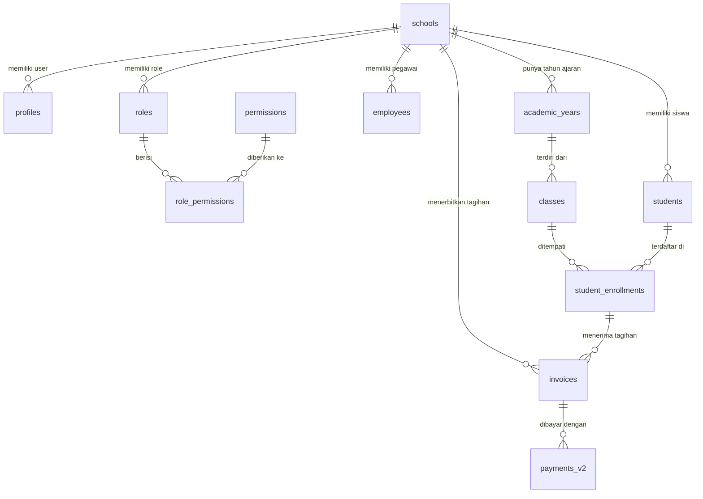

# Data Model & Struktur Database — ERP Sekolah

> Dokumen ini memetakan tabel-tabel utama di database, relasi antar tabel (Foreign Keys),
> serta tipe data penting. Setiap kali ada perubahan struktur database via Supabase Migration,
> dokumen ini **WAJIB** diperbarui.

---

## 1. Aturan Dasar Database

1. **Multi-Tenancy**: Seluruh tabel operasional (selain tabel referensi global) **WAJIB** memiliki kolom `school_id` bertipe `UUID` yang merujuk ke tabel `schools`.
2. **Primary Key**: Menggunakan UUID v4 untuk semua tabel.
3. **Auditing**: Hampir semua tabel utama memiliki kolom `created_at` (otomatis) dan `updated_at` (diperbarui via *trigger*).
4. **Row Level Security (RLS)**: Diterapkan di semua tabel tenant dengan *policy* yang memfilter baris berdasarkan `school_id` dari token pengguna yang aktif (`current_school_id()`).

---

## 2. Diagram Relasi Inti (Core & Tenant)

---

## 3. Modul Core & Auth

| Tabel Database | Deskripsi & Tipe Penting | Relasi / FK |
|---|---|---|
| `schools` | Identitas sekolah/pesantren.   - `status`: "trial" \| "active" \| "suspended" | — |
| `profiles` | Data login dan profil user.   - `is_super_admin`: boolean | FK: `school_id` -> `schools.id` |
| `roles` | Peran (RBAC) per sekolah. | FK: `school_id` -> `schools.id` |
| `permissions` | Master data izin (global, lihat `rbac.ts`). | — |
| `role_permissions` | Pivot tabel antara role dan permission. | FK: `role_id`, `permission_id` |

---

## 4. Modul Manajemen Orang

| Tabel Database | Deskripsi & Tipe Penting | Relasi / FK |
|---|---|---|
| `employees` | Data diri pegawai/guru.   - `is_active`: boolean | FK: `school_id`, `user_id` -> `profiles.id` |
| `pegawai_jabatan` | Relasi multi-jabatan untuk pegawai.   - `is_utama`: boolean | FK: `pegawai_id`, `jabatan_id` |
| `students` | Biodata lengkap siswa.   - `status`: "aktif" \| "lulus" \| "pindah" \| "keluar" | FK: `school_id`, `user_id` -> `profiles.id`, `agama_id` |

---

## 5. Modul Akademik

| Tabel Database | Deskripsi & Tipe Penting | Relasi / FK |
|---|---|---|
| `academic_years` | Tahun ajaran (contoh: 2024/2025).   - `status`: "draft" \| "active" \| "closed" | FK: `school_id` |
| `levels` | Jenjang pendidikan (TK, SD, SMP). | FK: `school_id` |
| `grades` | Tingkat kelas (Kelas 1, 2, 3). | FK: `education_level_id` |
| `departments`| Jurusan (IPA, IPS). | FK: `education_level_id` |
| `rooms` | Ruangan fisik kelas. | FK: `school_id` |
| `classes` | Kelas aktif pada tahun ajaran tertentu. | FK: `academic_year_id`, `grade_id`, `major_id`, `room_id` |
| `student_enrollments` | Pendaftaran/penempatan siswa di kelas.   - `status`: "active" \| "keluar" \| "pindah" \| "lulus"| FK: `student_id`, `class_id`, `academic_year_id` |

---

## 6. Modul Keuangan & Tagihan

| Tabel Database | Deskripsi & Tipe Penting | Relasi / FK |
|---|---|---|
| `fee_categories` | Kategori biaya (SPP, Gedung).   - `billing_cycle`: "bulanan" \| "semester" \| "tahunan" \| "sekali" | FK: `school_id` |
| `fee_structures` | Setting nominal biaya per tingkat/kelas. | FK: `fee_category_id`, `grade_id`, `academic_year_id` |
| `invoices` | Tagihan otomatis untuk siswa.   - `status`: "belum_bayar" \| "sebagian" \| "lunas" \| "batal" | FK: `student_id`, `academic_year_id` |
| `invoice_items` | Detail rincian per invoice. | FK: `invoice_id`, `fee_structure_id` |
| `payments_v2` | Catatan pembayaran.   - `status`: "menunggu" \| "terverifikasi" \| "ditolak" | FK: `invoice_id`, `payment_method_id` |
| `discounts` | Jenis diskon / beasiswa.   - `calc_type`: "percent" \| "fixed" | FK: `school_id` |
| `student_discounts`| Pemberian diskon spesifik ke siswa. | FK: `student_id`, `discount_type_id` |

---

## 7. Master Data (Referensi)

Tabel master data dibagi dua:
1. **Global (Tanpa `school_id`)**: `wilayah` (provinsi, kota, kecamatan), `agama`, `bank`, `jenjang_pendidikan`.
2. **Tenant (Dengan `school_id`)**: `status_kepegawaian`, `jabatan_pegawai` (struktural/fungsional), `golongan`, `unit_kerja`, `mapel`, `jenis_sertifikasi`, `jenis_cuti`.

---

## 8. Tipe Data Standar TypeScript (Reference)

Untuk definisi lengkap tipe data, *selalu* rujuk ke file `@/lib/types.ts` dan tipe hasil *generate* Supabase di `@/lib/database.types.ts`.

Gunakan fungsi Zod Schema yang berada di folder `src/features/<modul>/schema.ts` untuk memvalidasi objek yang akan masuk ke database.
